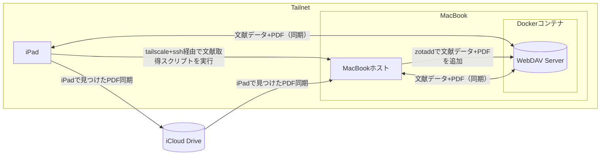

**TL;DR**
> Zoteroのクラウド同期は月額課金。でも**WebDAVサーバーを自分で立てれば無料で同期可能**！
> Docker + Tailscaleで、MacBook上にWebDAVサーバーを構築し、iPadからもシームレスにアクセス。
> さらに、iPad版Zoteroの自動メタデータ取得の弱点も、**iCloud + a-shell + 自動化スクリプト**で完全克服します！

## はじめに：Zoteroとは？

[前回の記事](https://zenn.dev/k1nsenka/articles/4c1c4f4fef8e01)で詳しく紹介しましたが、**Zotero**は無料のオープンソース文献管理ツールです。**が、** 単なる文献管理に留まらず、優秀なPDFリーダー＆メモアプリとしても活用できる万能ツールです。

> 「レポートの**参考文献リストを作るのが面倒**くさい...」
> 「実験レポートで引用した論文、どこに保存したっけ？」
> 「**iPadアプリ買ったのに論文管理とノートがバラバラで不便...**」

これらの悩みをすべて解決できるのがZoteroの魅力です。**NotabilityやGoodnoteなど高額なアプリを購入する必要もありません**。

### Zoteroの主な特徴（おさらい）

- **無料のオープンソース**：完全無料で使用可能
- **一元管理**：論文、教科書、課題PDFをすべて一箇所で管理
- **自動引用**：参考文献リストをワンクリックで生成
- **Apple Pencil対応**：iPadでの手書き注釈も可能
- **クロスプラットフォーム**：Windows、Mac、Linux、iOS、Android全対応

## 結論

この記事で構築したシステムにより、以下が実現できます：
### 材料（すぐ準備しなくてもいいです）
 - 基本的なネットワークインフラ
 - ハードウェア
   - Mac(MacBook, Windows【未検証】, ラズパイ【未検証】, NAS【未検証】, ...)
   - iPad(iPhone, Androidスマートフォン【未検証】)
 - ソフトウェア
   - iPad sshクライアント（今回はa-shell）
   - [Tailscale](https://tailscale.com)
   - Zotero
   - Docker
   - [Zotadd](https://github.com/sdx23/zotadd)

### この記事で実現できること

✅ **完全無料のZotero同期環境**
- WebDAVサーバーを自前構築
- 月額課金なしで実質容量制限なし
  - （ただし電気代かかるし無制限ではない）

✅ **iPad + MacBookのシームレス連携**
- Tailscaleによるリモートアクセス
- iCloud Driveでのファイル共有
  - (iCloudじゃなくても、ファイル同期できればなんでもヨシ！) 

✅ **iPad版Zoteroの制限を完全克服**
- 半自動メタデータ取得機能を実現
- コマンドライン + SSH で遠隔操作

✅ **研究効率の大幅向上**
- 論文発見から管理まで完全自動化
- Apple Pencilでの注釈も完璧に同期

### 投資対効果

- **初期投資**：Docker、Tailscale設定の数時間
- **月額コスト**：完全無料（Zotero Storage比較で年間最大14,400円節約）
- **作業効率**：論文管理にかかる時間が大幅短縮

### 応用可能性

この構成は他の用途にも応用できます：
- **他の研究ツール**：Obsidian、Logseqなどのノートアプリ
- **ファイル同期**：Nextcloud、ownCloudなどのクラウドサービス
- **開発環境**：リモート開発サーバーとしても活用可能

::: message
本記事はちと長い（コードもある）ので、今後楽になると思ってすこーーーしだけ気合いを入れて下さい。
ではさっそくいってみましょう！
:::

## 課題：Zotero公式同期は有料

Zoteroの唯一の弱点は、**公式のクラウド同期サービス（Zotero Storage）が有料**であることです。

### Zotero Storage料金プラン

- **無料プラン**：300MBまで（すぐに上限に達してしまう）
- **有料プラン**：月額2〜12ドル（年間2,400〜14,400円）

論文PDFを大量に扱う研究者や学生にとって、300MBはあっという間に埋まってしまいます。かといって月額課金は避けたい...

が、幸いにもwebDAVによる同期がサポートされています。
**そう、WebDAVの出番です！**

## 解決策：WebDAVで自前同期サーバー構築

WebDAVサーバーを自分で構築すれば、**完全無料でZoteroの同期が可能**になります。
> LLM時代あるある、なんでも自分で構築しようとする(なんとなくできてしまう) 

:::details WebDAV

WebDAV（Web-based Distributed Authoring and Versioning）は、HTTPプロトコルを拡張したファイル共有の仕組みです。
簡単に言うと、ウェブサーバー上のフォルダに、まるでローカルフォルダのようにファイルを保存・編集・削除できる技術です。通常のウェブサイトは「見る」だけですが、WebDAVでは「書き込む」こともできます。

普通のHTTP: ウェブページを「見る」だけ
WebDAV: ウェブサーバーに「ファイルを保存・編集」できる

多くのアプリケーション（Zotero、Obsidian、Nextcloudなど）がWebDAVに対応しており、自分でサーバーを立てれば無料でクラウドストレージのような機能を実現できるため、研究者や開発者に人気があります。

:::

### WebDAVのメリット

- **完全無料**：自分のサーバーなので課金一切なし（電気代だけ）
- **容量無制限**：ストレージ容量は自分次第
- **プライバシー**：データは完全に自分の管理下
- **高速同期**：ローカルネットワークでは特に高速

### 今回の構成

```
MacBook（ホストマシン）
├── Zotero公式アプリ
├── Docker（WebDAVサーバー）
├── Tailscale（リモートアクセス）
└── 自動化スクリプト

iPad
├── Zotero公式アプリ
├── a-shell（SSH接続用）
└── iCloud Drive（PDF共有用）
```
### 今回の概要図



## WebDAVサーバー構築手順

### 前提条件

- Docker Desktop for Mac がインストール済み
- Tailscale アカウント作成済み
- 基本的なターミナル操作の知識

### Step 1: プロジェクトディレクトリ作成

```bash
mkdir -p ~/zotero-webdav/{nginx,data,scripts}
cd ~/zotero-webdav
```

### Step 2: 環境変数ファイル作成
そのままプロジェクトルート( ~/zotero-webdav)でターミナルで実行
```bash
cat > .env << EOF
WEBDAV_USERNAME="username"
WEBDAV_PASSWORD="password"
HOST_PORT=1111
EOF
```

### Step 3: Dockerfile作成
プロジェクトルート( ~/zotero-webdav)にファイル追加
::::details dockerfile
```dockerfile
FROM alpine:latest

# nginxとWebDAVモジュールインストール
RUN apk --no-cache add nginx nginx-mod-http-dav-ext apache2-utils

# WebDAV保存ディレクトリ作成
RUN mkdir -p /var/lib/zotero/storage

# 環境変数からユーザー名とパスワードを受け取る
ARG WEBDAV_USERNAME
ARG WEBDAV_PASSWORD

# WebDAVユーザーとパスワード設定
RUN htpasswd -cb /etc/nginx/.htpasswd ${WEBDAV_USERNAME} ${WEBDAV_PASSWORD}

# Nginx設定ファイルをコピー
COPY nginx/default.conf /etc/nginx/http.d/default.conf

# パーミッション設定
RUN chown -R nginx:nginx /var/lib/zotero

# WebDAVポート公開
EXPOSE 80

# Nginx起動
CMD ["nginx", "-g", "daemon off;"]
```
::::

### Step 4: Nginx設定ファイル作成
そのままプロジェクトルート( ~/zotero-webdav)でターミナルで実行
::::details nginx/default.conf
```bash
mkdir -p nginx
cat > nginx/default.conf << 'EOF'
server {
    listen 80;
    server_name localhost;

    location /zotero {
        root /var/lib;
        
        # WebDAV設定
        dav_methods PUT DELETE MKCOL COPY MOVE;
        dav_ext_methods PROPFIND PROPPATCH LOCK UNLOCK;
        dav_access user:rw group:r all:r;
        
        # 認証設定
        auth_basic "Zotero WebDAV";
        auth_basic_user_file /etc/nginx/.htpasswd;
        
        # ファイルサイズ制限
        client_max_body_size 500M;
        
        # 自動インデックス
        autoindex on;
        autoindex_exact_size off;
        autoindex_localtime on;
        
        # ヘッダー設定
        add_header Cache-Control "no-cache, must-revalidate";
    }
}
EOF
```
::::

### Step 5: Docker Compose設定
::: message alert

docker-composeでビルドする際に、パスワードなどの情報を引数(arg)として与えるとセキュリティ的に良くないぽい、が、今回は個人的な物（&tailescaleを信じる）なので目を瞑ります。（要注意）

（今回は一応.envファイルにユーザーネームとパスワードを保管しているが、効果ないらしい。イメージを共有したときにログを解析されるとパスワードとかがバレるらしい。）

:::

プロジェクトルート( ~/zotero-webdav)にdocker-compose.yamlファイルを追加

```yaml
services:
  zotero-webdav:
    build:
      context: .
      args:
        WEBDAV_USERNAME: ${WEBDAV_USERNAME}
        WEBDAV_PASSWORD: ${WEBDAV_PASSWORD}
    container_name: zotero-webdav
    restart: unless-stopped
    ports:
      - "${HOST_PORT}:80"
    volumes:
      - ./data:/var/lib/zotero
    env_file:
      - .env

volumes:
  zotero-data:
```

### Step 6: 自動起動スクリプト作成

いちいちdockerコマンドを打つのがめんどいので、私はよく起動スクリプトを書きます。

起動スクリプト（`scripts/start.sh`）:
そのままプロジェクトルート( ~/zotero-webdav)でターミナルで実行
::::details start.sh
```bash
#!/bin/bash

# Dockerディレクトリに移動
cd "$HOME/zotero-webdav"

# コンテナ起動確認
if docker ps | grep -q "zotero-webdav"; then
	echo "Zotero WebDAVコンテナは既に起動中です。"
else
	# コンテナ起動
	docker-compose up -d
	echo "Zotero WebDAVコンテナを起動しました。"

	# TailscaleのIP取得
	TAILSCALE_IP=$(tailscale ip -4 2>/dev/null || echo "Not available")

	echo "WebDAV URL: http://localhost:1111/zotero"
	if [ "$TAILSCALE_IP" != "Not available" ]; then
		echo "Tailscale URL: http://$TAILSCALE_IP:1111/zotero"
	fi
fi
```
::::

### Step 7: 実行権限付与

start.shに実行権限付与：

```bash
chmod +x start.sh
```

これでこのスクリプトでは以下が自動実行されます：
- Docker コンテナのビルドと起動
- Tailscale IP の表示

### Step Ex: Mac**Book** 使用者向け

MacBookをサーバーみたいに使える設定をしておいて下さい。
ちらっと列挙しておくと、

* batteryアプリによる充電80%維持（クラムシェルモードだと少し難あった）
* クラムシェルモード運用
* スリープさせない設定

などなどです。調べれば出てくると思いますが、暇だったら後で記事を追加したいと思います。


## Zotero + WebDAV設定方法

### Mac版 Zotero

1. Zotero > 環境設定 > 同期
2. 「ファイルの同期」で「WebDAV」を選択
3. 設定値を入力：
   - **URL**: `http://localhost:1111/zotero`
   - **ユーザー名**: `username`
   - **パスワード**: `password`
4. 「サーバーの確認」をクリック
5. 成功メッセージを確認して「OK」

### iPad版 Zotero

1. tailscaleアプリかホームページでIPかmagic DNSを調べておく
2. Zotero アプリ > Settings > Sync
3. 一旦data syncにログイン（アカウント作成必要あり）
4. 「File Syncing」で「WebDAV」を選択
5. 設定値を入力：
   - **URL**: `http://[TAILSCALE_IP]:1111/zotero`
   - **Username**: `username`
   - **Password**: `password`
6. 「Verify Server」をタップ
7. 成功メッセージを確認

## iPad版Zoteroの課題と解決策

iPad版Zoteroには重要な制限があります。

それは**自動メタデータ取得機能がない**ことです。

### 課題

- PDFファイルをiPadで直接Zoteroに追加しても、論文のタイトルや著者情報が自動取得されない
- Macを開いて手動でメタデータを入力するのは非効率
- 出先でMacがなかったら文献追加やり直し
- せっかく作った便利な同期機能が腐る

### 解決策：iCloud + SSH + 自動化スクリプト

この課題を以下のワークフローで解決します：

1. iPadで論文などPDF収集
2. iCloudでMacとPDF同期
3. iPadからMacBookへSSH接続
4. 文献追加スクリプトをリモート実行
5. WebDAVを通じてiPadに文献が追加されるのを待つ

## Mac側での準備：自動化システムの構築

### Step 1: iCloud Drive フォルダ準備

iCloudで書類同期をオンにするか、同期用フォルダを作って下さい(その際はパスに注意)。

```bash
mkdir -p ~/Documents/zotero-contents/{new,moved}
```

- `new/`: iPadから追加される新しいPDFファイル
- `moved/`: 処理済みのPDFファイル

### Step 2: zotadd インストール

zotaddは、コマンドラインからZoteroにファイルを追加できるツールです。

```bash
# Homebrewでインストール
brew install zotadd

# または直接ダウンロード
curl -L https://github.com/sdx23/zotadd/releases/latest/download/zotadd-macos -o /usr/local/bin/zotadd
chmod +x /usr/local/bin/zotadd
```

### Step 3: 自動処理スクリプト作成

`/PathTo/`を自分のPCものに置き換えて下さい。

`zotero_process.sh`:

~/zotero-contents/にファイル追加

::::details zotero_process.sh
```bash
#!/bin/bash
# Zotero PDF処理スクリプト (zotadd使用版) - 改良版

# 設定
SOURCE_DIR="/PathTo/Documents/zotero-contents/new"
DEST_DIR="/PathTo/Documents/zotero-contents/moved"
WAIT_TIME=15  # メタデータ処理を待機する秒数
FILE_WAIT_TIME=3  # ファイル間の追加待機時間

# zotaddコマンドのパス
ZOTADD_CMD="/usr/local/bin/zotadd"

# ログファイル
LOG_FILE="zotero_processing.log"

# ディレクトリの作成
mkdir -p "$DEST_DIR"

# メッセージをログに記録する関数
log() {
    echo "$(date '+%Y-%m-%d %H:%M:%S') - $1" | tee -a "$LOG_FILE"
}

# スクリプトの開始
log "Zotero PDF処理スクリプト（zotadd使用版）- 改良版を開始します"

# zotaddコマンドが利用可能か確認
if ! command -v "$ZOTADD_CMD" &> /dev/null; then
    log "エラー: zotaddコマンドが見つかりません。パスが正しいか確認してください: $ZOTADD_CMD"
    exit 1
fi

# Zoteroが実行中か確認
if ! pgrep -x "Zotero" > /dev/null; then
    log "警告: Zoteroが実行中ではないようです。"
    read -p "続行しますか？ (y/n): " -n 1 -r
    echo
    if [[ ! $REPLY =~ ^[Yy]$ ]]; then
        log "ユーザーによってスクリプトが中断されました。"
        exit 1
    fi
fi

# コマンドでzoteroを起動する
open -a 'Zotero.app'

# ソースディレクトリ内のPDFファイルを検索
pdf_files=$(find "$SOURCE_DIR" -name "*.pdf" -type f)
pdf_count=$(echo "$pdf_files" | grep -c '^' || echo "0")

if [ "$pdf_count" -eq 0 ]; then
    log "PDFファイルが見つかりません: $SOURCE_DIR"
    exit 0
fi

log "$pdf_count 個のPDFファイルを処理します。"

# 成功・失敗カウンタ
success_count=0
failed_count=0

# 各PDFファイルを一つずつ処理
echo "$pdf_files" | while read -r pdf_file; do
    if [ -z "$pdf_file" ]; then
        continue
    fi
    
    file_name=$(basename "$pdf_file")
    log "============================================="
    log "処理中 ($((success_count + failed_count + 1))/$pdf_count): $file_name"
    
    # ファイルが存在し、読み取り可能か確認
    if [ ! -f "$pdf_file" ] || [ ! -r "$pdf_file" ]; then
        log "エラー: ファイルが存在しないか読み取れません: $pdf_file"
        failed_count=$((failed_count + 1))
        continue
    fi
    
    # ファイルサイズを確認
    file_size=$(du -k "$pdf_file" | cut -f1)
    log "ファイルサイズ: ${file_size}KB"
    
    # zotaddを使ってPDFをZoteroに追加
    log "zotaddを使用してZoteroにPDFを追加: $pdf_file"
    
    # タイムアウト付きでzotaddを実行（30秒でタイムアウト）
    if timeout 30s "$ZOTADD_CMD" "$pdf_file"; then
        log "Zotero追加成功"
        
        # Zoteroがメタデータを処理するのを待機
        log "${WAIT_TIME}秒間待機中..."
        sleep $WAIT_TIME
        
        # PDFを移動先ディレクトリへ移動
        log "ファイルを移動: $DEST_DIR/$file_name"
        if mv "$pdf_file" "$DEST_DIR/$file_name"; then
            log "移動成功: $file_name"
            success_count=$((success_count + 1))
        else
            log "エラー: ファイルの移動に失敗しました: $file_name"
            failed_count=$((failed_count + 1))
        fi
    else
        log "エラー: Zoteroへの追加に失敗しました: $file_name"
        failed_count=$((failed_count + 1))
    fi
    
    # ファイル間で追加の待機時間を設ける
    log "次のファイル処理まで ${FILE_WAIT_TIME}秒間待機中..."
    sleep $FILE_WAIT_TIME
done

# 処理結果を表示
log "============================================="
log "処理完了: 成功=${success_count}個, 失敗=${failed_count}個, 合計=${pdf_count}個"
log "WebDAVと同期するには、Zoteroアプリケーションで同期操作を実行してください。"

exit 0
```
::::

### Step 4: スクリプトに実行権限付与

```bash
chmod +x zotero_process.sh
```

## iPad での準備

### 必要なアプリ

1. **a-shell** (App Store): SSH接続用ターミナルアプリ
2. **Zotero** (App Store): 公式Zoteroアプリ

### ワークフロー手順

#### 1. iPadで論文を発見

- Safari、Google Scholar、ArXivなどで論文を見つける
- PDFをダウンロード

#### 2. iCloud Driveに保存

- ダウンロードしたPDFを`iCloud Drive/Documents/zotero-contents/new/`に保存
- ファイル名は適当でOK（例：`paper_about_AI.pdf`）

#### 3. a-shellでSSH接続

a-shellアプリを開いて、MacBookにSSH接続：

```bash
# Tailscale IPでSSH接続
ssh username@[TAILSCALE_IP]

# またはローカルIPで接続
ssh username@192.168.1.xxx
```
:::details a-shellでのssh

a-shellのホームディレクトリに、`.ssh/config`を作成することができるのでおすすめ

:::


#### 4. 自動処理スクリプト実行

```bash
cd ~/Documents/zotero-contents
./zotero_process.sh
```

スクリプトが以下を自動実行：
1. `new/`フォルダ内のPDFファイルを検出
2. zotaddでZoteroの未整理アイテムに追加
3. Zoteroがメタデータを自動取得（DOI、タイトル、著者など）
4. 処理済みファイルを`moved/`フォルダに移動


#### 5. Zoteroで同期

- MacのZoteroで同期が完了
- iPadのZoteroアプリでも同期
- メタデータ付きの論文がiPadでも利用可能に！

### ワークフロー例

```
【iPad側】
1. Google Scholarで論文発見
2. PDFダウンロード → iCloud Drive/Documents/zotero-contents/new/

【a-shell】
3. ssh username@[TAILSCALE_IP]
4. cd ~/Documents/zotero-contents && ./zotero_process.sh

【結果】
5. 数分後（大抵1分以内に同期される）、iPadのZoteroアプリに完全な論文情報が追加される
   - タイトル、著者、DOI、アブストラクト
   - Apple Pencilでの注釈も可能
   - 引用情報も完璧
```

## 運用のコツとトラブルシューティング

### 運用のコツ

1. **定期的な同期**：iPad作業後は必ずZoteroで同期
2. **ログの確認**：処理に失敗した場合はログファイルを確認
3. **ファイル名の工夫**：分かりやすいファイル名を付ける
4. **バックアップ**：重要な論文は複数箇所に保存

### よくある問題と解決策

#### WebDAV接続エラー

```bash
# コンテナが起動しているか確認
docker ps | grep zotero-webdav

# ログを確認
docker logs zotero-webdav

# 再起動
cd ~/zotero-webdav && docker-compose restart
```

#### zotadd実行エラー

```bash
# Zoteroが起動しているか確認
pgrep -x "Zotero"

# zotaddのパスを確認
which zotadd

# 権限を確認
ls -la /usr/local/bin/zotadd
```
::: message alert

Zotaddは、Mac側で**Zoteroウィンドウを開いていないと**動かないっぽいので注意。

外出する際はZoteroを開いておいて下さい。

:::

#### Tailscale接続問題

```bash
# Tailscaleの状態確認
tailscale status

# IP再取得
tailscale ip -4
```

## さいごに

お疲れさまでした！この記事を通じて、**完全無料のZotero同期環境**と**iPad版Zoteroの制限を克服するワークフロー**を構築できたのではないでしょうか。

最初は設定が複雑に感じるかもしれませんが、一度構築してしまえば、研究生活が劇的に変わることを実感していただけるはずです。特に、iPadでの論文読み＋Apple Pencil注釈＋自動メタデータ取得の組み合わせは、まさに**理想の研究環境**と言えるでしょう。

この環境で、レポート作成、論文執筆、試験勉強がどれだけ楽になるか、ぜひ体験してみてください。**研究生活がもっと楽しく、もっと効率的になることを心から願っています！**

:::message
不明な点があれば、コメント欄でお気軽にお聞きください。また、この記事が役に立った場合は、ぜひ❤️をお願いします！この記事をきっかけに、より多くの研究者・学生の方が効率的な研究環境を手に入れられることを願っています。
:::

## 参考リンク

- [Zotero公式サイト](https://www.zotero.org/)
- [zotadd GitHub](https://github.com/sdx23/zotadd)
- [Tailscale公式サイト](https://tailscale.com/)
- [Docker公式サイト](https://www.docker.com/)
- [前回記事：Zoteroのススメ](https://zenn.dev/k1nsenka/articles/4c1c4f4fef8e01)
